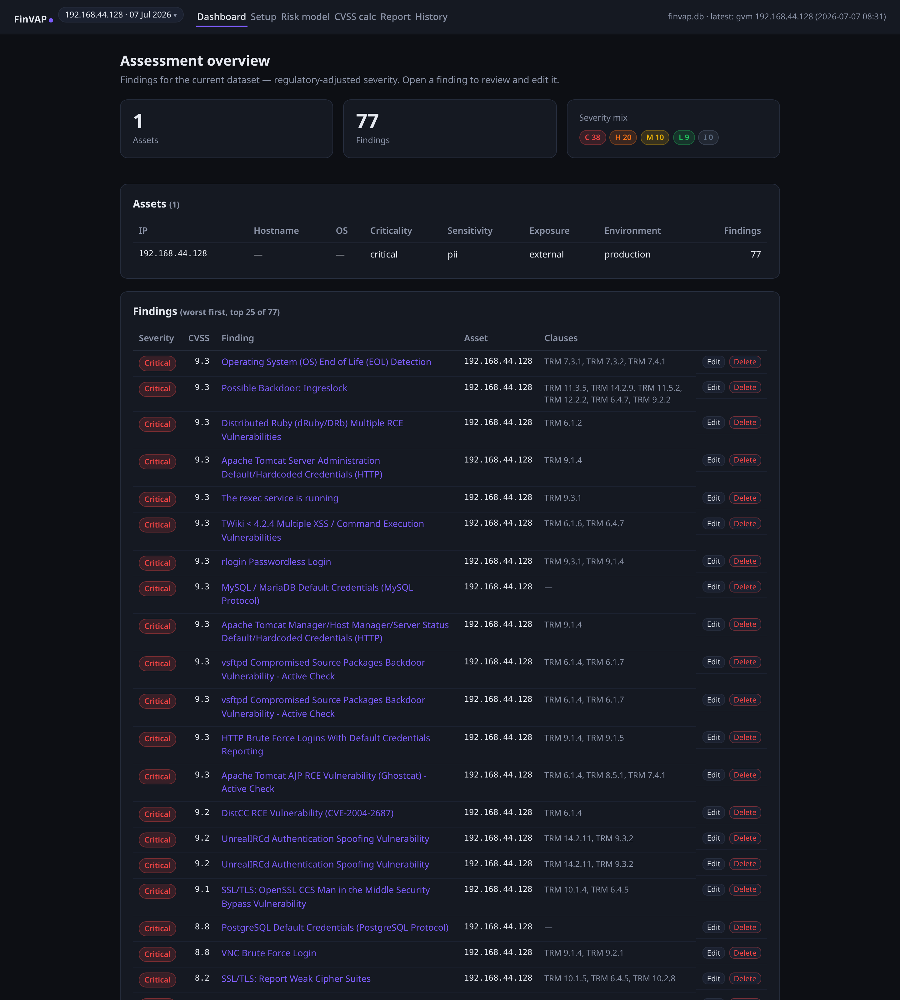
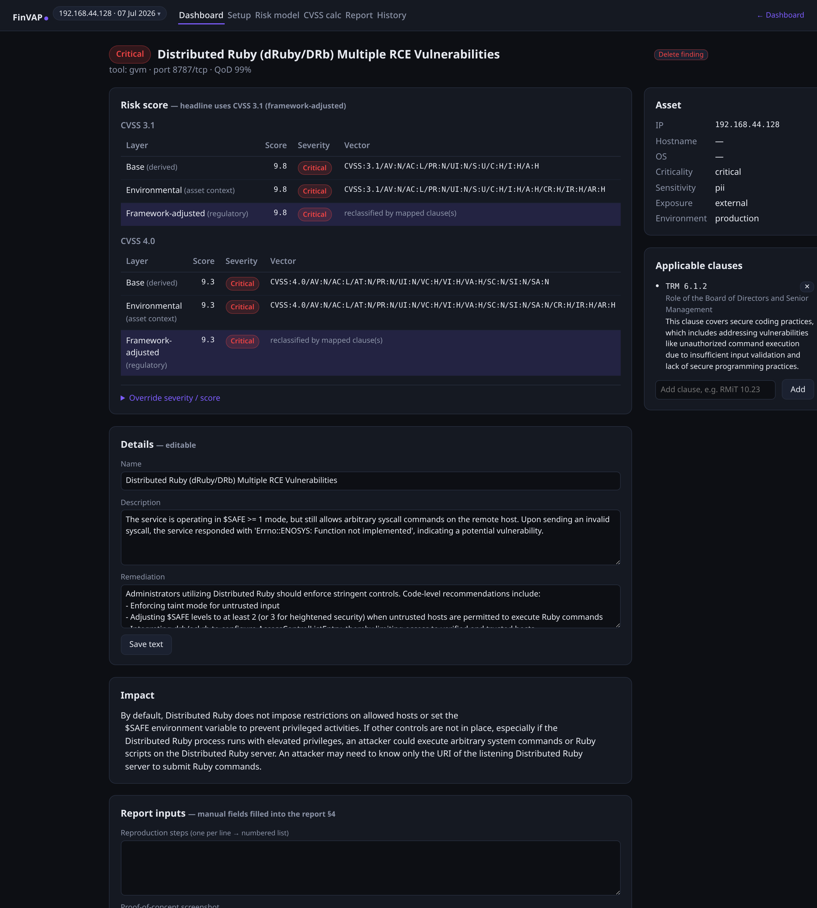
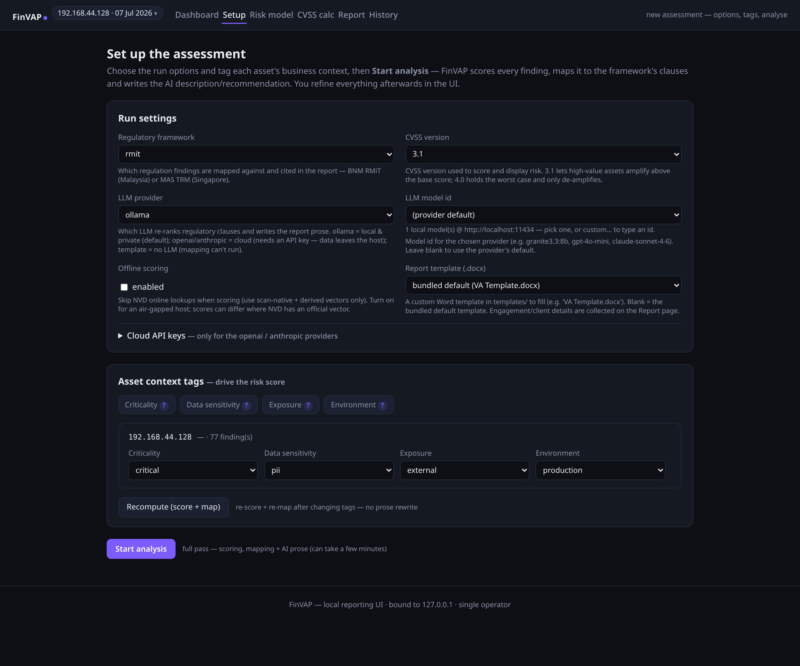
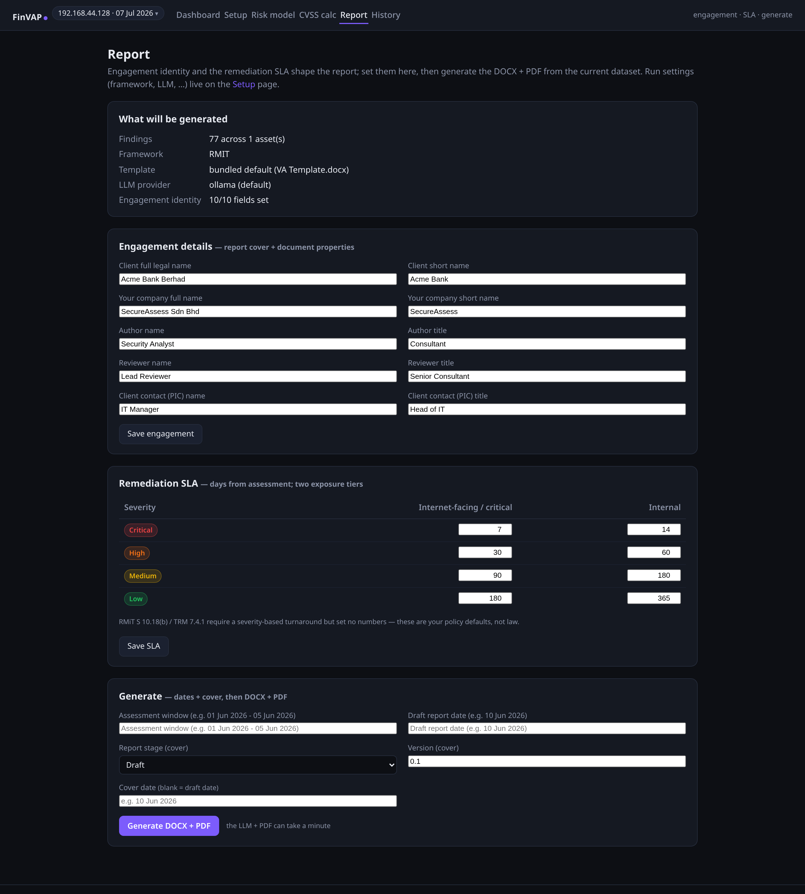
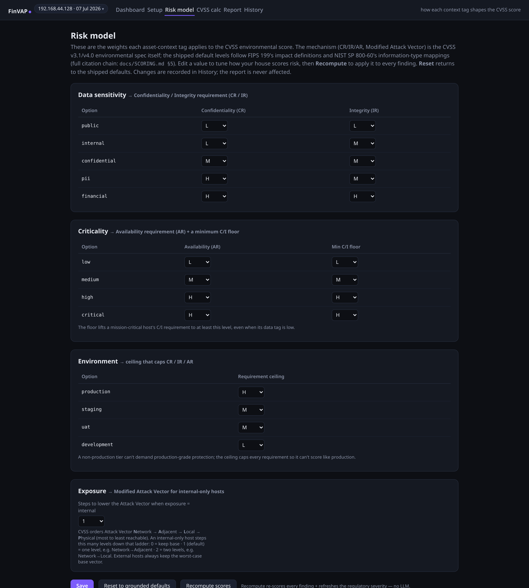
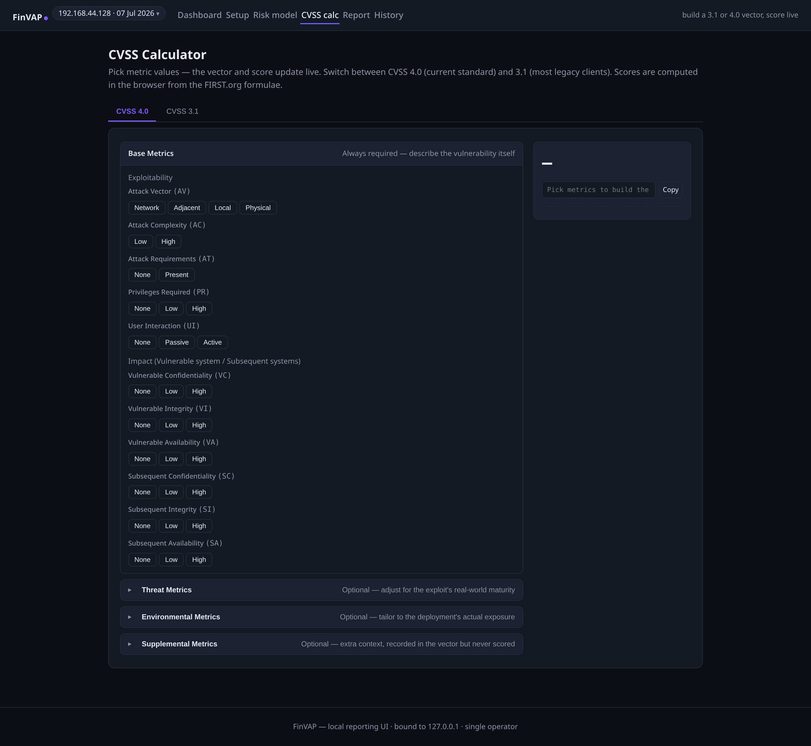

<div align="center">

# FinVAP

### Financial Vulnerability Assessment Platform

*Scans infrastructure, scores each vulnerability by **business context**, maps every finding to **local financial regulations** (BNM RMiT / MAS TRM), and generates an auditor-ready report — all local, no cloud required.*

</div>

---

## Screenshots

| Assessment dashboard | Per-finding risk & regulation |
|---|---|
|  |  |

| Set up & tag assets | Report generation |
|---|---|
|  |  |

| Editable risk model | Built-in CVSS calculator |
|---|---|
|  |  |

## Features

- **Multi-tool scanning** — Nmap discovery + Greenbone/GVM vulnerability scan into one store; or import a Nessus `.nessus` export.
- **Context-based risk scoring** — true CVSS **environmental** recompute (3.1 **and** 4.0) driven by four asset tags: criticality, data sensitivity, exposure, environment.
- **Regulatory mapping** — local RAG + LLM re-rank maps each finding to the **BNM RMiT** / **MAS TRM** clause it implicates, then adjusts the severity band.
- **AI report generation** — fills your own Word `.docx` template → **DOCX + PDF**, with an AI-written executive summary and per-finding prose.
- **Privacy by default** — the LLM runs **locally**; every AI call masks IPs/hostnames first, with an automated leak-check and a full audit trail to prove it.
- **Human-in-the-loop** — override any score, rewrite any text, curate the cited clauses; edits are durable across re-runs.
- **Built-in tooling** — a CVSS 3.1/4.0 calculator and an editable risk model, in the browser.
- **Local & single-user** — the web UI binds `127.0.0.1` only, no accounts, no cloud.

## Setup

Kali / Debian-based Linux, Python 3.13.

**1. Install:**

```bash
git clone https://github.com/ReihanPramudito/finvap_uat.git finvap
cd finvap
python3 -m venv .venv && source .venv/bin/activate
pip install -e .
```

**2. Set up Greenbone/GVM** for vulnerability scanning (one-time; feeds are several GB):

```bash
sudo apt install -y gvm gvm-tools
sudo gvm-setup && sudo gvm-start          # note the admin password it prints
export FINVAP_GVM_USER=admin
export FINVAP_GVM_PASS='<password-from-gvm-setup>'
finvap doctor                              # verify everything is ready
```

Full steps + troubleshooting: **[docs/GVM-SETUP.md](docs/GVM-SETUP.md)**.
*No Greenbone handy? `finvap <ip> --no-gvm` does an Nmap-only run, or `finvap scan.nessus` imports a Nessus export — both skip GVM entirely.*

**3. Install the local LLM** (Ollama — powers the regulatory mapping and report prose):

```bash
curl -fsSL https://ollama.com/install.sh | sh
ollama pull granite3.3:8b
```

> **API key note:** the model runs on your machine and FinVAP masks every identifier before it's sent, so nothing leaves the host. Prefer a cloud model instead? Choose the **openai** or **anthropic** provider and paste an API key on the **Setup** page — but be aware your (masked) data then leaves the host.

**4. Scan and report:**

```bash
finvap 192.168.1.10        # scan, then the web UI opens automatically
```

## Typical Workflow

A typical assessment workflow using FinVAP:

1. **Scan** — `finvap <target>` (a single IP, a comma-separated list, an Nmap range/CIDR, or a path to a `.nessus` file). FinVAP runs Nmap + GVM, stores the findings, and opens the web UI.
2. **Tag the assets** — on the **Setup** page, set each asset's criticality, data sensitivity, exposure and environment. These four tags are what make the score context-aware.
3. **Analyse** — click **Start analysis**. FinVAP scores every finding (CVSS 3.1 + 4.0), maps it to the RMiT/TRM clauses it implicates, and writes the AI description + recommendation.
4. **Review & edit** — open any finding to see its **base → context-adjusted → regulation-adjusted** score and cited clauses; override a severity, rewrite text, or curate clauses wherever you disagree.
5. **Report** — fill the engagement details and remediation SLA, then **Generate** → **DOCX + PDF**.
6. **Come back later** — `finvap web` reopens the UI on the current project without re-scanning. Each new scan is its own project.

That's the whole CLI — three commands: `finvap <target>`, `finvap web`, `finvap doctor`.

## Documentation (Work in Progress)

| Doc | What's in it |
|---|---|
| [WEBUI.md](docs/WEBUI.md) | The web UI — every page and what it does |
| [USAGE.md](docs/USAGE.md) | Command reference + environment variables |
| [SCORING.md](docs/SCORING.md) | Scoring methodology (CVSS environmental, the tag→metric model, worked examples) |
| [TEMPLATES.md](docs/TEMPLATES.md) | Authoring your own Word report template |
| [GVM-SETUP.md](docs/GVM-SETUP.md) | Greenbone install + troubleshooting |

## Tech stack

- **Core:** Python 3.13 · Typer (CLI) · SQLModel + SQLite
- **Web:** FastAPI + HTMX + Jinja (server-rendered, `127.0.0.1` only)
- **Scanning:** Nmap · python-gvm (Greenbone) · Nessus import
- **Scoring:** the FIRST `cvss` library (v2 / 3.1 / 4.0 environmental)
- **Regulation mapping:** ChromaDB (local ONNX MiniLM embeddings, no PyTorch) + an LLM re-rank
- **Reporting:** python-docx + LibreOffice (PDF)
- **LLM:** Ollama (local, default) · OpenAI-compatible · Claude — provider-agnostic

## Regulations

Regulatory mapping needs the source PDFs in `regulations/` — `pd-rmit-nov25.pdf`
(BNM RMiT) and/or `mas-trm-2021.pdf` (MAS TRM). FinVAP builds a local vector index
from them on first use (downloads a ~80 MB embedding model once; no external API).

---

<div align="center">
<sub>FinVAP — Financial Vulnerability Assessment Platform.</sub>
</div>
